# AI-Based Reconciliation System 

An enterprise-grade, production-ready double-entry financial reconciliation application built using the MERN stack with dynamic AI-powered transaction matching, risk controls, and automated reporting.

Designed and optimized to be suitable for Final Year Engineering projects, placement reviews, and technical showcase portfolios.

---

## 📚 Table of Contents

- [Live Demo](#️-live-demo)
- [Key Features](#-key-features)
- [Tech Stack](#-tech-stack)
- [Project Structure](#-system-folder-structure)
- [Screenshot Overview](#-screenshots)
- [Getting Started & Local Setup](#-getting-started--local-setup)
  - [Environment Setup](#prerequisites)
  - [Server Setup](#step-1-set-up-the-backend)
  - [Client Setup](#step-2-set-up-the-frontend)
- [Security Architecture](#-security-architecture)
- [Contact](#-contact)

---

## �️ Live Demo

Check out the live portfolio here: [🔗 View Portfolio](https://ai-based-reconciliation-system-frontend.onrender.com)

---

## 🛠 Tech Stack

- **Frontend**: React.js, Tailwind CSS, Vite, Recharts, Lucide Icons, Axios, React Router v6.
- **Backend**: Node.js, Express.js, Socket.IO, Multer, PDFKit, XLSX, CSV-Parser, Fuse.js.
- **Database**: MongoDB & Mongoose (with index optimizations).
- **Authentication**: JWT Authorization, bcrypt password hashing, and role-based route security (Admin/User).

---

## 📁 System Folder Structure

```text
ai-recon-system/
├── backend/
│   ├── config/             # DB connection & Socket server wrappers
│   ├── controllers/        # Express handlers (Auth, Recon, Dashboard, Reports, Sharing)
│   ├── middlewares/        # JWT Protections, Rate Limiters, File uploads
│   ├── models/             # Mongoose schemas (User, Transaction, Match, AuditLog, ShareLink)
│   ├── routes/             # RESTful API route declarations
│   ├── services/           # Business logic (Reconciliation, Fraud, Exporters, Sharing)
│   ├── utils/              # Algorithms (Levenshtein, Cosine, Seeder script)
│   ├── server.js           # Server Entry point
│   └── package.json
└── frontend/
    ├── src/
    │   ├── context/        # Auth & Dark Theme contexts
    │   ├── layouts/        # Dashboard layout sidebar
    │   ├── pages/          # Login, Dashboard, Workbench, Fraud, Audits, Sharing
    │   └── App.jsx         # Routes definition
    ├── tailwind.config.js
    └── package.json

```

---

## 📸 Screenshots

### 🔐 Authentication
| Login | Register |
|:----:|:----:|
| 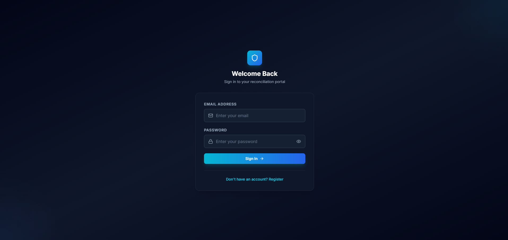 | 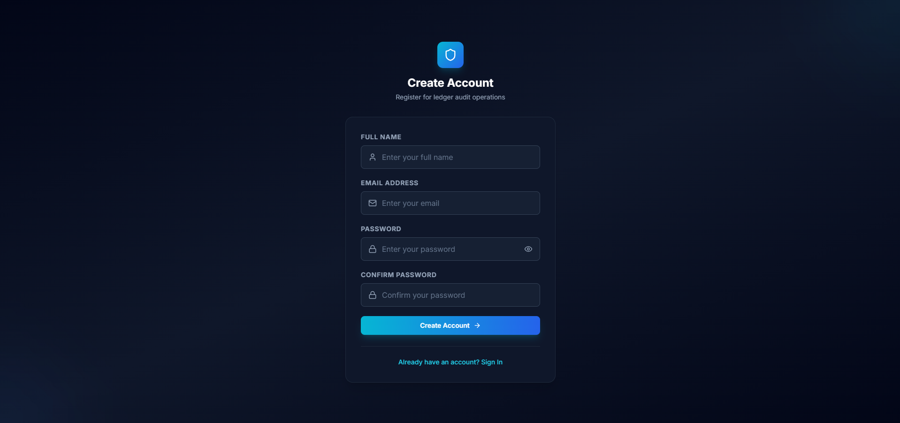 |

### 📊 Dashboard & Workbench
| Dashboard |
|:----:|
| 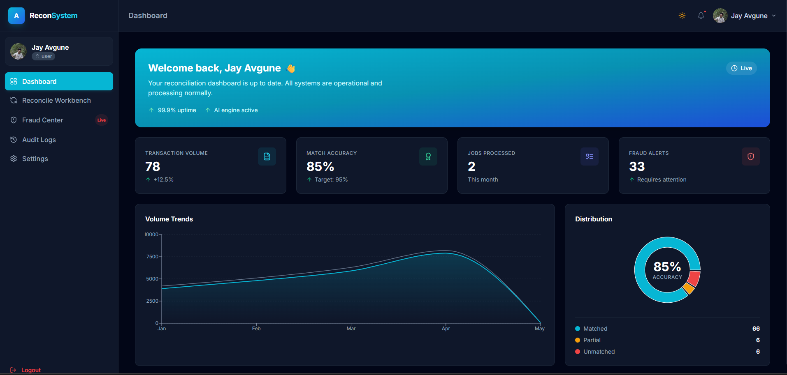 |

### 📁 File Upload
| Upload Interface | Reconciliation Workbench |
|:----:|:----:|
| 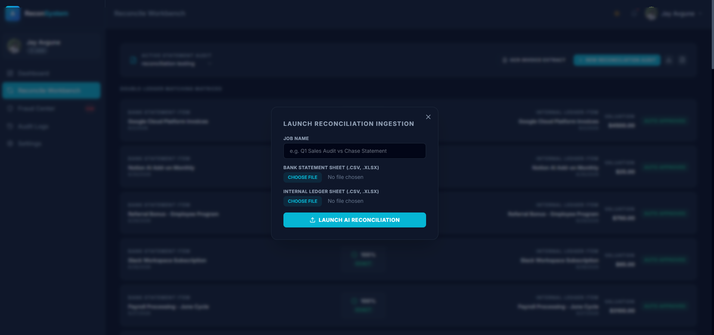 | 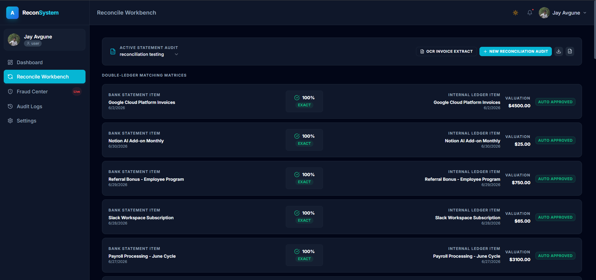 |

### 🚨 Fraud Detection & Audit
| Fraud Alerts | Audit Logs |
|:----:|:----:|
| 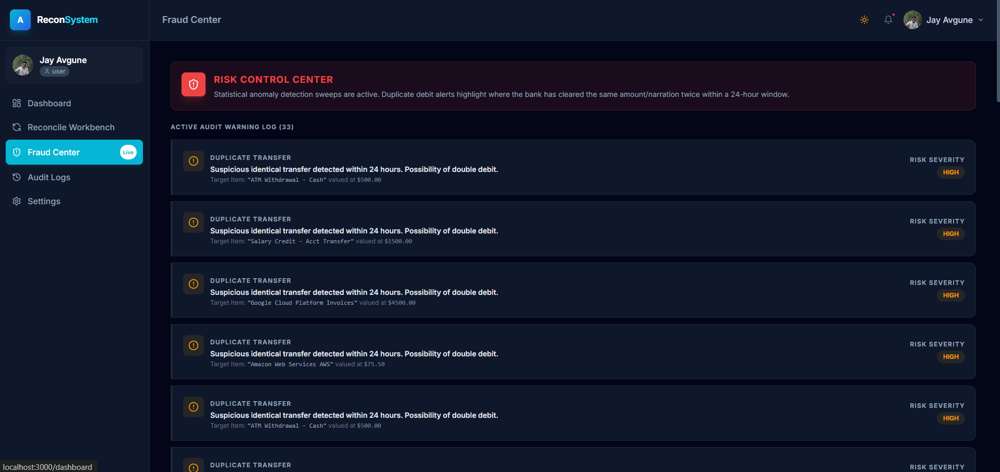 | 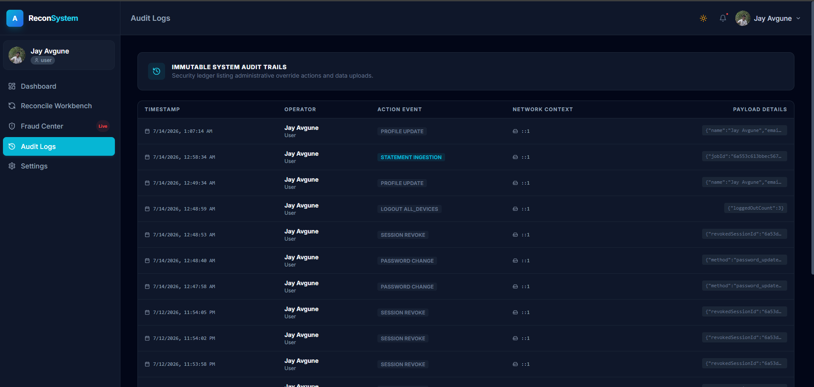 |

### ⚙️ Settings Pages
| Profile Settings | Storage Overview | Password Change |
|:----:|:----:|:----:|
| 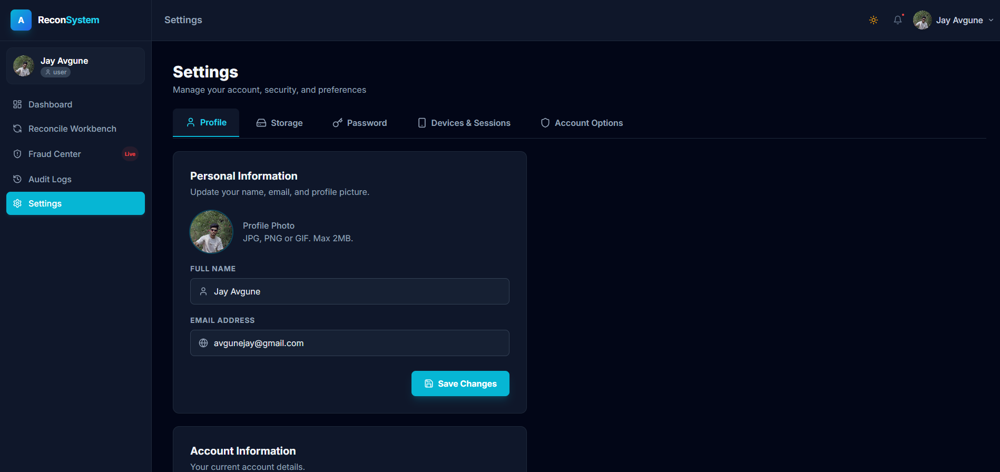 | 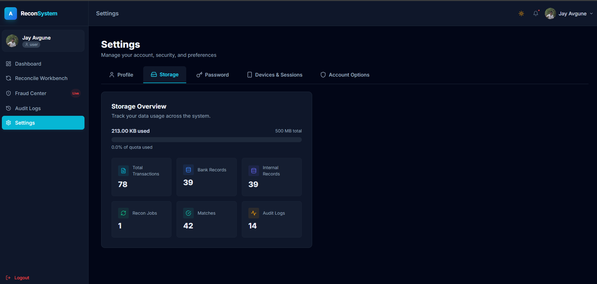 | 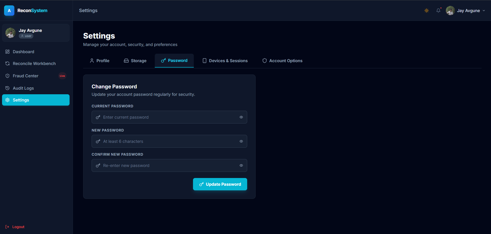 |

| Devices & Sessions | Account Options |
|:----:|:----:|
| 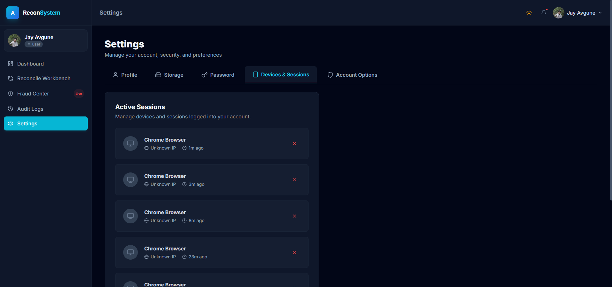 | 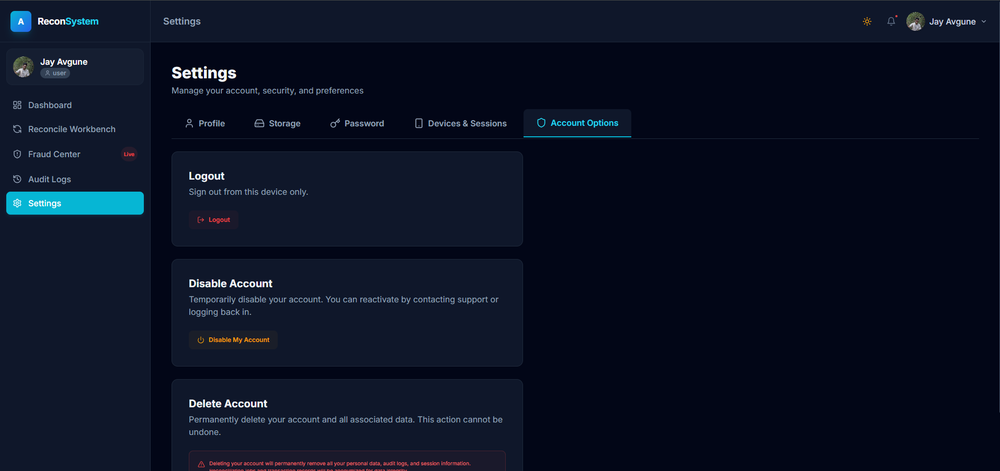 |

---

## 🚀 Key Features

### 1. **Hybrid AI Matching Engine**
- Calculates multi-pass transaction matching:
  1. **Deterministic filter**: Scans matching external Transaction reference IDs and perfect Amount/Date fits.
  2. **Character N-Gram Cosine Similarity**: Measures spelling and word arrangement similarity (e.g. `AMAZONPAY INDIA` ↔ `Amazon Pay`).
  3. **Jaro-Winkler & Levenshtein Distances**: Provides highly accurate string proximity scores.
- Assigns a dynamic **Confidence Score %** and compiles natural-language **AI Explanations** for match validations.

### 2. **Continuous Risk Heuristics (Fraud Detection)**
- **Velocity Spikes**: Flags multiple identical debit transactions occurring within a 1-hour window.
- **Double Debits**: Alarms users if the bank has processed duplicate transfers within a 24-hour timeframe.
- **Statistical Outliers**: Employs standard deviation scoring (Z-Score > 2.5) to isolate extreme anomalous transaction amounts dynamically.

### 3. **Structured Ingestion & Processing**
- Features a dropzone to drag-and-drop CSV or Excel sheets.
- **Dynamic Headers Normalizer**: Auto-detects and aligns mismatching column headers (e.g., matching "UTR No", "Ref ID", or "Transaction No" to the schema's `transactionId`).
- **Invoice OCR extraction**: Mock pipeline demonstrating Tesseract.js text extraction from invoice receipts.

### 4. **Sharing & Permissions**
- **Share** reconciliation files via email (registered users) or direct link (guest users).
- **Role-based access**: Assign **Viewer** (read-only) or **Editor** (modify/re-run) permissions.
- **Dashboard** with *Shared by Me* and *Shared with Me* views + real-time permission updates.
- **Activity logs** track share events; **access revocation** is instant.

### 5. **Enterprise Audit & Exporters**
- Export **PDF Reconciliation Reports** with job summaries and match pairs.
- Generate **multi-sheet Excel** files for bookkeeping.
- Full **Audit Log** tracking all user actions.

---

## 🏃 Getting Started & Local Setup

### **Prerequisites**
- Install Node.js (v18 or higher)
- Run a local MongoDB server (`mongodb://localhost:27017`) or configure a MongoDB Atlas connection string.

### **Step 1: Set up the Backend**
1. Navigate to the backend folder:
   ```bash
   cd backend
   ```
2. Configure your environment variables:
   ```ini
   PORT=
   MONGO_URI=
   JWT_SECRET=
   NODE_ENV=
   ```
3. Run the DB Seeder to populate initial data, default accounts, and graphs:
   ```bash
   npm run seed
   ```
4. Start the development API server:
   ```bash
   npm run dev
   ```

### **Step 2: Set up the Frontend**
1. Navigate to the frontend folder:
   ```bash
   cd ../frontend
   ```
2. Start the Vite React client:
   ```bash
   npm run dev
   ```
3. Access the portal at: `http://localhost:3000/`

---

## 🔒 Security Architecture

1. **Authentication**: JWT token signatures with short TTL, mapped directly to secure Axios request headers.
2. **API Rate Limiter**: Limits uploads to 20 sheets per 5 minutes per IP to prevent storage flooding.
3. **Data Sanitization**: Mongoose schema compilations and parameter sanitization to neutralize NoSQL injections.
4. **Header Hardening**: Leverages `Helmet` to obscure internal Express fingerprints.
5. **Share Link Tokens**: Unique, expirable tokens for guest share links with optional passphrase protection.

---

## 📬 Contact

Feel free to reach out to me:

- [LinkedIn](https://www.linkedin.com/in/jay-avgune-1316b323a?utm_source=share&utm_campaign=share_via&utm_content=profile&utm_medium=android_app)